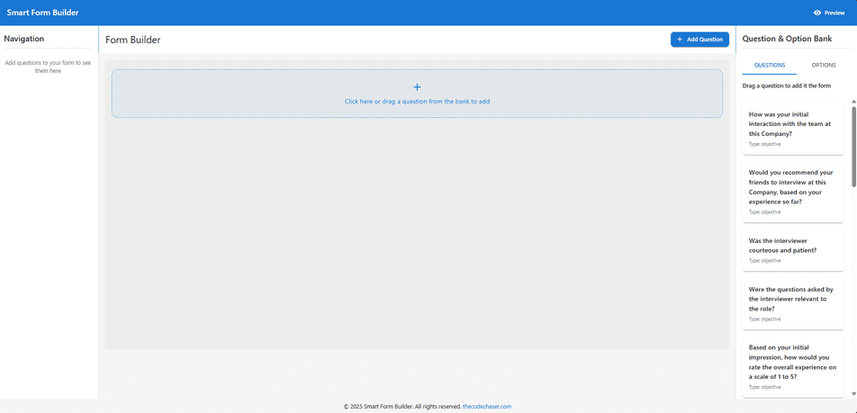

# Smart Form Builder

> Smart Form Builder is a dynamic form creation tool that empowers users to design custom forms with ease. Users can add questions and options manually or via drag-and-drop. Each option can have follow-up questions, allowing for deeply nested, conditional logic. Whether creating simple surveys or complex decision trees, Smart Form Builder offers a flexible and intuitive interface for building interactive forms.

## Preview:




## Built With

- HTML
- CSS
- JavaScript
- REACT
- Redux
- Vite
- Material UI

## Live version

[Smart Form Builder](https://form-builder-codechaser.netlify.app/)

## Getting Started

To get a local copy up and running follow these simple example steps.

### Prerequisites
- A text editor(preferably Visual Studio Code)
- Node
- Web browser

### Install
- [Git](https://git-scm.com/downloads)
- [Node](https://nodejs.org/en/download/)

### Using it Locally

- Clone the project

```bash 
git clone git@github.com:thecodechaser/smart-form-builder.git

cd smart-form-builder
```

- Install dependencies

```bash
npm i 
or
npm install
```
- To Start the development server
```bash
npm run dev
```

- To test the project
```bash
npm run test
```


## Visit And Open Files

[Visit Repo](https://github.com/thecodechaser/smart-form-builder)

## Download Repo

[Download Repo](https://github.com/thecodechaser/smart-form-builder/archive/refs/heads/main.zip)

## Authors

👤 **Ranjeet Singh**

- Website: [thecodechaser.com](https://thecodechaser.com)
- GitHub: [@thecodechaser](https://github.com/thecodechaser)
- Twitter: [@thecodechaser](https://twitter.com/thecodechaser)
- LinkedIn: [thecodechaser](https://linkedin.com/in/thecodechaser)

## 🤝 Contributing

Contributions, issues, and feature requests are welcome!

Feel free to check the [issues page](https://github.com/thecodechaser/smart-form-builder/issues).

## Show your support

Give a ⭐️ if you like this project!

## Acknowledgments

- Inspiration: Microverse

## 📝 License

This project is [MIT](./LICENSE) licensed.
